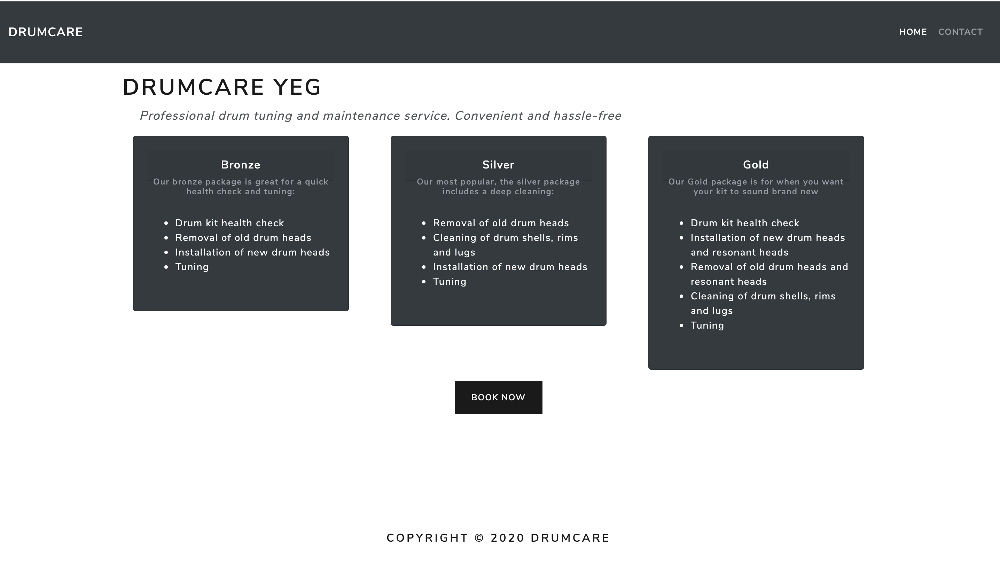

# DrumCare
Online home for drum maintenance business local to Edmonton, AB

The user lands at the home page to learn about different packages available, fills out a form
which contains name, email, date, package desired etc. If the "Other" option is chosen in the package selection part of the form, 
a textbox appears where the user can send in a custom message. Currently DrumCare is in development, and uses nodemailer to send to a company email. 

<!-- Format:  -->
